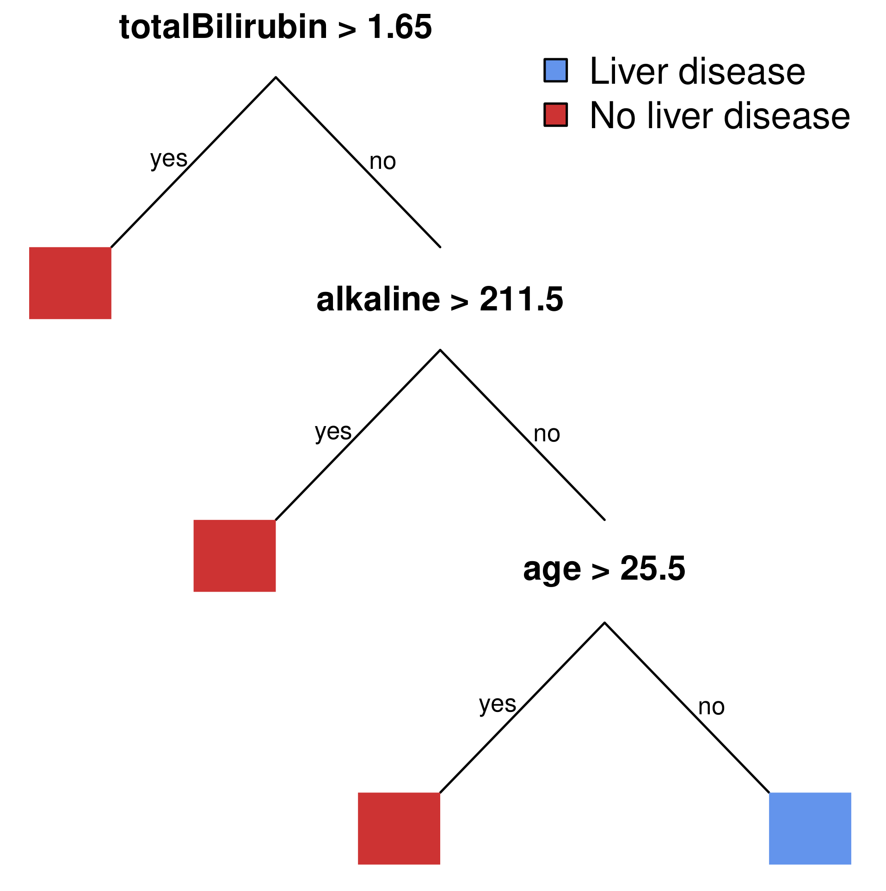

<!-- README.md is generated from README.Rmd. Please edit that file -->

<!-- badges: start -->

<!-- badges: end -->

## Fast-and-frugal classification in R (ffcr)

The *ffcr* package allows the construction of two families of
transparent classification models: *fast-and-frugal trees* and
*tallying* models. The book *Classification in the Wild: The Science and
Art of Transparent Decision Making.* (Katiskopoulos et al., 2020)
describes these models, their applications and the algorithms to
construct these in detail.

A fast-and-frugal tree is a decision tree with a simple structure: one
branch of each node exits tree, the other continues to the next node
until the final node is reached. A tallying model gives pieces of
evidence the same weight. The package implemts several methods for
training these models, ranging from simple heuristics to computationyll
more complex cross-entropy optimization (Rubinstein, 1999).

There exist an alternative excellent R package to train fast-and-frugal
trees, [FFTrees](https://github.com/ndphillips/FFTrees).

## Installation

You can install ffcr using from this GitHub page with

``` r
# install.packages("devtools")
devtools::install_github("marcusbuckmann/ffcr")
```

or download the Windows Binary *ffcr\_1.0.zip* and install it from your
hard drive.

## How to use the package

To illustrate the functionality of the package, we use a medical
problem, predicting which patients have a liver condition. We start with
loading the package and the data (Dua & Graff, 2017; Ramana, Surendra &
Venkateswarlu, 2011), which is included in the package.

``` r
library(ffcr)
data(liver)
```

## Training fast-and-frugal trees

We start by training a fast-and-frugal tree on the Liver data set. If
the first column in the data set is the class label, we can simply pass
the data set as the first argument.

``` r
model <- fftree(liver, use_features_once = FALSE, method = "greedy", max_depth = 4)
```

The model object shows the structure of the trees and its performance on
the data set.

``` r
print(model)
#> Fast-and-frugal Tree object
#>   type: "recursive" 
#> 
#> Call: 
#> fftree(data = data, method = "greedy", max_depth = 4, use_features_once = FALSE, 
#>     formula = formula)
#> 
#> Formula: 
#> diagnosis ~ age + sex + totalBilirubin + directBilirubin + alkaline + 
#>     alamine + aspartate + proteins + albumin + albuminGlobulin
#> 
#> Tree: 
#> 
#>  Reason: Predicted class - (Proportion of class Liver disease) (Number of objects classified)
#> 
#>   totalBilirubin > 1.65: Liver disease (1.00) (213)
#>     alkaline > 211.5: Liver disease (1.00) (132)
#>       age <= 25.5: No liver disease (0.00) (27)
#>         age > 25.5: Liver disease (0.55) (207)
#> 
#> 
#> Fitted values:
#>             Observed       Predicted    N
#>        Liver disease    Liver disease   0
#>     No liver disease    Liver disease 552
#>        Liver disease No liver disease   0
#>     No liver disease No liver disease  27
#> 
#> Fitting:                            
#>     AUC                   NA
#>     Accuracy            0.05
#>     Sensitivity          NaN
#>     Specificity         0.05
#>     Balanced accuracy    NaN
#>     F1 score            0.00
#>                   
#>     Depth     3.00
#>     Features  3.00
#>     Frugality 2.04
```

To visualize the tree we use

``` r
plot(model)
```



To make predictions according to a fast-and-frugal tree, we can use the
`predict` function.

``` r
predict(model, newdata = liver[301:nrow(liver),], type = "metric")
#>               AUC          Accuracy       Sensitivity       Specificity 
#>        0.70779612        0.69892473        0.96891192        0.09302326 
#> Balanced accuracy          F1 score    True positives   False positives 
#>        0.53096759        0.81659389      187.00000000       78.00000000 
#>    True negatives   False negatives 
#>        8.00000000        6.00000000
```

## Training tallying models

To train tallying models, we use the *tally* function.

``` r
model <- tally(liver, max_size = 4)
```

Please consult the vignette of the package for more details on the
functionalities of the package and the book *Classification in the Wild*
for background information on fast-and-frugal trees and tallying models.

# References

Dua, Dheeru, and Casey Graff. 2017. “UCI Machine Learning Repository.”
University of California, Irvine, School of Information; Computer
Sciences. <http://archive.ics.uci.edu/ml>.

Katikopoulos, Konstantinos V., Özgür Şimşek, Marcus Buckmann, and Gerd
Gigerenzer. 2020. Classification in the Wild: The Science and Art of
Transparent Decision Making. MIT Press.

Ramana, Bendi Venkata, M Surendra Prasad Babu, and N. B. Venkateswarlu.
2011. “A Critical Study of Selected Classification Algorithms for Liver
Disease Diagnosis.” International Journal of Database Management Systems
3 (2): 101–14.

Rubinstein, Reuven. 1999. “The Cross-Entropy Method for Combinatorial
and Continuous Optimization.” Methodology and Computing in Applied
Probability 1 (2): 127–90.
